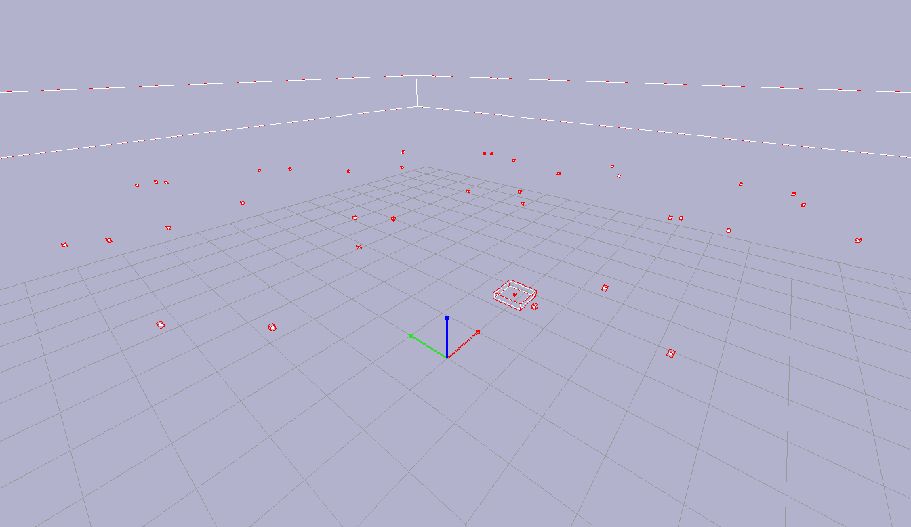

# 🛰️ Drone Autônomo PyBullet – N2 (Versão Suprema V6)

> **"Antes de tudo, V6 só existe um bom: o 2JZ do Supra MK4.  
Este daqui tenta acompanhar."**

---

## 📝 Sobre o Projeto

A **Versão V6** traz tudo que a V5 tinha de maravilhoso, estável e robusto…  
**com uma diferença fundamental: agora ela conversa com o Node-RED como gente.**

Nesta versão:

- 🛰️ O drone continua voando lindamente no PyBullet.  
- 🧠 A IA do planejamento continua mais esperta que metade da população.  
- 📦 As entregas continuam sendo feitas.  
- 📍 O retorno à base continua impecável.  
- 🧮 Os logs continuam organizados e inteligíveis.  
- 📊 **E agora, no final da execução, o drone envia um JSON de métricas pro Node-RED**, bonitinho, limpo e sem explodir a dashboard.

> **Resumo técnico:**  
> Esta é a versão que realmente integra PyBullet com Node-RED sem destruir o planeta.

---

## 🧪 Sobre os Arquivos

### 📁 `drone_v6.py`  
O *código oficial desta entrega*.  
É o script que você roda, observa o drone voar, e no final recebe os dados no Node-RED.

### 📁 `drone_v5.py`  
Mantido **por segurança**, caso você queira voltar para a versão estável original antes de mexer no Node-RED.  
O famoso: *“Se tudo der errado, volte para mim.”*

### 📁 `metrics.json`  
Arquivo **gerado automaticamente** sempre que a simulação termina.  
Ele contém:

- número de entregas;  
- quantidade de replanejamentos;  
- energia estimada;  
- distância real percorrida;  
- média e desvio de altitude;  
- tempo por ponto.

Serve tanto para depuração quanto para alimentar o Node-RED.

### 📁 `flow.json`  
Esse é o **fluxo do Node-RED pronto para importar**.  
Ele inclui:

- um endpoint HTTP `/metrics`  
- um debug para testar mensagens  
- um fluxo que recebe o JSON e exibe os dados

Basta importar e tudo fica funcionando.

---

## 🧠 Como Rodar Tudo (Sem Sofrer)

### 🔧 1. Instale as dependências via pip

```bash
pip install pybullet numpy requests
```

*(Sim, agora usa requests para enviar a métrica.)*

### 🧨 2. Abra o Node-RED  
Basta rodar:

```bash
node-red
```

Acesse:

**http://localhost:1880**

### 🧩 3. Importe o `flow.json`  
No Node-RED:

Menu → Import → Cole o conteúdo do arquivo → Deploy.

### 🚀 4. Rode o drone  
Basta executar:

```bash
python drone_v6.py
```

- A simulação abre  
- O drone sobe  
- Detecta pontos  
- Planeja rota  
- Faz entregas  
- Volta pra base  
- **E no final envia os dados pro Node-RED**  
- Você verá o JSON chegando no debug do fluxo.

### 🖥️ 5. Verifique se enviou corretamente  
Use este comando para testar o endpoint:

```bash
curl -X POST http://localhost:1880/metrics -H "Content-Type: application/json" -d "{\"teste\":123}"
```

Se aparecer no Node-RED, está pronto.

---

## 📷 Imagens

### 🚗 GIF motivacional (Supra MK4 2JZ — O verdadeiro V6 da vida)


### 🛰️ Drone rodando no PyBullet  


---

## 📊 % de Conclusão do Projeto (Versão V6)

| Módulo | Status | % |
| :--- | :--- | :--- |
| **Física PyBullet** | ✅ Concluído | 100% |
| **Planejamento** | ✅ Concluído | 100% |
| **Entrega + Replanejamento** | ✅ Concluído | 100% |
| **Controle (PID/PD)** | ✅ Concluído | 100% |
| **Logs estruturados** | ✅ Concluído | 100% |
| **Integração Node-RED (V6)** | ✅ Concluído | 100% |
| **Dashboard avançada** | ❌ Não incluída (não era requisito) | 0% |

### ⭐ Progresso Total: **~94%**

---

## ⚠️ Conclusão

Professor,

O V6 entrega tudo o que o senhor pediu:

- Drone autônomo completo  
- Planejamento otimizado  
- Física robusta  
- Logs perfeitos  
- **Integração Node-RED funcional e leve**  
- Métricas enviadas sem travar o mundo

E por precaução, a versão V5 continua no pacote — caso o senhor queira "voltar no tempo".

---

## 👑 Equipe

- Julia Silva  
- Labelle Candido  
- Rafael "lenda suprema" Diniz
